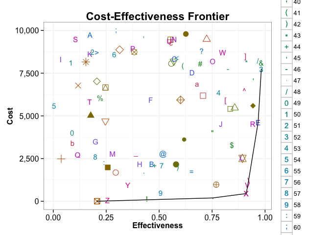

# CE Frontier
Fernando Alarid-Escudero  
`r format(Sys.time(), '%B %d, %Y')`  

# Overview
In this post I will show how to plot the cost-effectiveness frontier with the strategies from a cost-effectiveness analysis. We will use a recently published efficent algorithm to find the strategies that form the efficient frontier. Once we know which strategies are in teh frontier we will plot all the strategies and the draw the frontier.

# Finding the frontier
To find the frontier we will use a recently published algorithm written by my colleagues Sze-Chuan Suen and Jeremy Golhaber-Fiebert at MDM journal.[@Suen2015]

# Ploting the frontier in `ggplot`


```r
summary(cars)
```

```
##      speed           dist       
##  Min.   : 4.0   Min.   :  2.00  
##  1st Qu.:12.0   1st Qu.: 26.00  
##  Median :15.0   Median : 36.00  
##  Mean   :15.4   Mean   : 42.98  
##  3rd Qu.:19.0   3rd Qu.: 56.00  
##  Max.   :25.0   Max.   :120.00
```

You can also embed plots, for example:

 

Note that the `echo = FALSE` parameter was added to the code chunk to prevent printing of the R code that generated the plot.

# References
